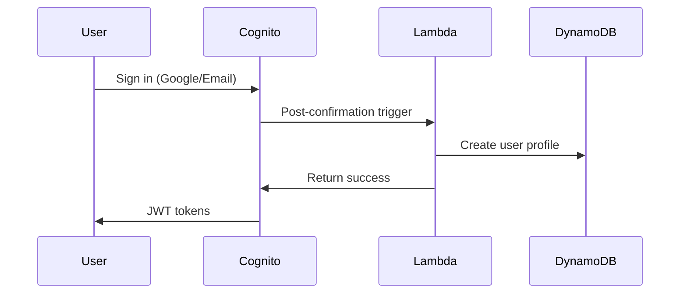

# DRISHTI.AI - Industrial Behavioral Intelligence Engine.
# Drishti.AI System Design Document
*Following AWS Well-Architected Framework*

## Executive Summary
Drishti.AI implements an Agency-First behavioral intervention engine using AWS-native services. The architecture prioritizes the Industrial Innovation features: Truth-Engine, Predictive Digital Twin, and Ghost HR Agent, built on a foundation of Single-Table DynamoDB design and Event-Driven Architecture.

## AWS Well-Architected Framework Alignment

### 1. Operational Excellence
- **Infrastructure as Code**: All AWS resources defined via CloudFormation/CDK
- **Monitoring**: CloudWatch dashboards for system health and user behavior
- **Automation**: EventBridge-driven workflows for behavioral nudges
- **Documentation**: Comprehensive API documentation and runbooks

### 2. Security
- **Identity Management**: Amazon Cognito with multi-provider authentication
- **Data Protection**: Encryption at rest (DynamoDB) and in transit (HTTPS/TLS)
- **Access Control**: IAM roles with least privilege principle
- **Secrets Management**: AWS Secrets Manager for API keys and tokens

### 3. Reliability
- **Fault Tolerance**: Multi-AZ deployments for critical services
- **Backup Strategy**: Point-in-time recovery for DynamoDB
- **Error Handling**: Dead letter queues for failed Lambda executions
- **Circuit Breakers**: Exponential backoff for external API calls

### 4. Performance Efficiency
- **Caching**: ElastiCache Redis for leaderboards and frequent queries
- **CDN**: CloudFront for static content delivery
- **Database Optimization**: Single-table DynamoDB with efficient access patterns
- **Serverless**: Lambda functions for automatic scaling

### 5. Cost Optimization
- **Serverless Architecture**: Pay-per-use model with Lambda and DynamoDB
- **Resource Rightsizing**: Automated scaling based on demand
- **Reserved Capacity**: DynamoDB reserved capacity for predictable workloads
- **Lifecycle Policies**: S3 lifecycle rules for log archival

### 6. Sustainability
- **Serverless Computing**: Reduced carbon footprint through efficient resource utilization
- **Regional Deployment**: Single region (ap-south-1) to minimize data transfer
- **Efficient Algorithms**: Optimized queries and caching to reduce compute cycles

## Core Architecture

### Single-Table DynamoDB Schema

#### Primary Table: `Drishti_Core`

```json
{
  "TableName": "Drishti_Core",
  "KeySchema": [
    {
      "AttributeName": "PK",
      "KeyType": "HASH"
    },
    {
      "AttributeName": "SK", 
      "KeyType": "RANGE"
    }
  ],
  "AttributeDefinitions": [
    {
      "AttributeName": "PK",
      "AttributeType": "S"
    },
    {
      "AttributeName": "SK",
      "AttributeType": "S"
    },
    {
      "AttributeName": "GSI1PK",
      "AttributeType": "S"
    },
    {
      "AttributeName": "GSI1SK",
      "AttributeType": "S"
    }
  ],
  "GlobalSecondaryIndexes": [
    {
      "IndexName": "GSI1",
      "KeySchema": [
        {
          "AttributeName": "GSI1PK",
          "KeyType": "HASH"
        },
        {
          "AttributeName": "GSI1SK",
          "KeyType": "RANGE"
        }
      ]
    }
  ]
}
```

#### Access Patterns

| Entity Type | PK | SK | GSI1PK | GSI1SK |
|-------------|----|----|--------|--------|
| User Profile | USER#\<cognito_id\> | PROFILE | COLLEGE#\<tier\> | USER#\<cognito_id\> |
| User Track | USER#\<cognito_id\> | TRACK#\<goal_id\> | TRACK#\<goal_id\> | STATUS#\<status\> |
| Roadmap | ROADMAP#\<track_id\> | ROADMAP | CATEGORY#\<type\> | CREATED#\<timestamp\> |
| Hidden Gem | GEM#\<source_type\> | GEM#\<gem_id\> | SKILL#\<skill_name\> | QUALITY#\<score\> |
| AQI History | USER#\<cognito_id\> | AQI#\<timestamp\> | DATE#\<date\> | SCORE#\<aqi_score\> |
| Audit Result | USER#\<cognito_id\> | AUDIT#\<timestamp\> | COURSE#\<course_id\> | HYPE#\<score\> |
| Payment Stake | USER#\<cognito_id\> | STAKE#\<goal_id\> | STATUS#\<status\> | AMOUNT#\<value\> |

### Event-Driven Architecture for Behavioral Nudges

#### EventBridge Rules Configuration

```json
{
  "Rules": [
    {
      "Name": "MorningSlap",
      "ScheduleExpression": "cron(0 9 * * ? *)",
      "Targets": [
        {
          "Id": "MorningSlap",
          "Arn": "arn:aws:lambda:ap-south-1:account:function:MorningSlap",
          "Input": "{\"type\": \"MORNING_CHALLENGE\"}"
        }
      ]
    },
    {
      "Name": "NightlyAudit", 
      "ScheduleExpression": "cron(0 22 * * ? *)",
      "Targets": [
        {
          "Id": "NightlyAudit",
          "Arn": "arn:aws:lambda:ap-south-1:account:function:NightlyAudit",
          "Input": "{\"type\": \"ACTIVITY_CHECK\"}"
        }
      ]
    },
    {
      "Name": "UserActivityStream",
      "EventPattern": {
        "source": ["drishti.user.activity"],
        "detail-type": ["User Progress Update"]
      },
      "Targets": [
        {
          "Id": "AQICalculator",
          "Arn": "arn:aws:lambda:ap-south-1:account:function:AQICalculator"
        }
      ]
    }
  ]
}
```

## Industrial Innovation Features Architecture

### 1. Truth-Engine Implementation

#### Components
```yaml
TruthEngine:
  DeepResearchAgent:
    Service: AWS Lambda
    Runtime: Python 3.11
    Memory: 1024MB
    Timeout: 300s
    Environment:
      TAVILY_API_KEY: !Ref TavilyApiKey
      EXA_API_KEY: !Ref ExaApiKey
    
  KnowledgeBase:
    Service: Amazon OpenSearch Serverless
    Configuration:
      IndexName: hidden-gems
      VectorDimensions: 1536
      Engine: nmslib
    
  CodeVerification:
    Service: AWS Lambda
    Runtime: Node.js 18
    Environment:
      GITHUB_TOKEN: !Ref GitHubToken
    Triggers:
      - EventBridge: UserCommitEvent
    
  ReasoningEngine:
    Service: Amazon Bedrock
    Model: anthropic.claude-3-5-sonnet-20241022-v2:0
    SystemPrompt: |
      You are a cynical Engineering Manager at a top-tier Indian Startup. 
      When evaluating resources, ignore SEO-optimized content. Focus on:
      1. Engineering blogs from companies like Zomato, Swiggy, Netflix
      2. Niche GitHub 'Awesome' lists  
      3. Original whitepapers
      Combine these into a 'Logic-First' path.
```

#### Data Flow
1. **Resource Discovery**: Lambda scrapes high-signal sources using Tavily/Exa APIs
2. **Semantic Analysis**: Bedrock analyzes content for foundational logic density
3. **Vector Storage**: OpenSearch stores embeddings for instant retrieval
4. **Verification Loop**: GitHub API validates user progress against committed code
5. **Quality Scoring**: ML model ranks resources by signal-to-noise ratio

### 2. Predictive Digital Twin Architecture

#### Components
```yaml
PredictiveDigitalTwin:
  TrajectoryModeling:
    Service: Amazon SageMaker
    Algorithm: XGBoost Regression
    Features:
      - current_aqi: Integer (0-1000)
      - consistency_index: Float (0-1.0)
      - skill_velocity: Integer (skills/month)
      - market_relevance: Float (0-1.0)
    
  ProfileGeneration:
    Service: Amazon Bedrock
    Model: anthropic.claude-3-5-sonnet-20241022-v2:0
    SystemPrompt: |
      Generate realistic LinkedIn profiles based on trajectory predictions.
      IF current_aqi < 400: Generate 'Version A' - minimal growth, service firms
      IF current_aqi > 800: Generate 'Version B' - rapid promotions, staff engineer
      Use 'Strict Mentor' tone to explain the gap.
    
  DataPipeline:
    Service: AWS Step Functions
    Definition:
      StartAt: CollectUserData
      States:
        CollectUserData:
          Type: Task
          Resource: !GetAtt DataCollector.Arn
          Next: RunPrediction
        RunPrediction:
          Type: Task
          Resource: !GetAtt SageMakerInvoke.Arn
          Next: GenerateProfile
        GenerateProfile:
          Type: Task
          Resource: !GetAtt BedrockInvoke.Arn
          End: true
```

#### Prediction Model Training
```python
# SageMaker Training Script
import pandas as pd
from sklearn.ensemble import RandomForestRegressor
import joblib

def train_model():
    # Features: AQI, consistency, skill_velocity, market_relevance
    # Target: career_outcome_score (0-1000)
    
    model = RandomForestRegressor(
        n_estimators=100,
        max_depth=10,
        random_state=42
    )
    
    # Training data from historical user outcomes
    model.fit(X_train, y_train)
    
    # Model artifacts stored in S3
    joblib.dump(model, '/opt/ml/model/model.pkl')
```

### 3. Ghost HR Agent Architecture

#### Components
```yaml
GhostHRAgent:
  HeadlessScraper:
    Service: AWS Lambda
    Runtime: Python 3.11
    Memory: 2048MB
    Timeout: 900s
    Layers:
      - PlaywrightLayer
    Environment:
      PROXY_ROTATION_ENABLED: true
    
  AgenticReasoning:
    Service: Amazon Bedrock
    Model: anthropic.claude-3-5-sonnet-20241022-v2:0
    SystemPrompt: |
      Analyze LinkedIn profiles of engineers at target companies.
      Extract common technical stacks, project types, and seniority markers.
      Identify 'Invisible Skills' present in 80% of profiles but not taught in college.
      Output prioritized 'Reroute Tasks' for skill gap closure.
    
  GapVisualization:
    Service: Amazon QuickSight
    Datasets:
      - UserSkills: DynamoDB connector
      - BenchmarkSkills: S3 data source
    Visualizations:
      - RadarChart: Skill comparison
      - GapAnalysis: Missing skills priority
    
  RoadmapSync:
    Service: AWS Lambda
    Triggers:
      - EventBridge: GapAnalysisComplete
    Function: Update user roadmap with gap-filler modules
```

#### Scraping Workflow
```python
# Lambda function for ethical LinkedIn scraping
import playwright
from playwright.async_api import async_playwright

async def scrape_company_engineers(company_name: str):
    async with async_playwright() as p:
        browser = await p.chromium.launch(headless=True)
        page = await browser.new_page()
        
        # Search for engineers at target company
        search_query = f'site:linkedin.com/in/ "Software Engineer" at "{company_name}"'
        
        # Extract skills, experience, projects
        profiles = await extract_profile_data(page, search_query)
        
        # Analyze common patterns
        skill_frequency = analyze_skill_patterns(profiles)
        
        await browser.close()
        return skill_frequency
```

## Supporting Architecture Components

### Knowledge Graph (Amazon Neptune)
```yaml
NeptuneCluster:
  Engine: neptune
  EngineVersion: 1.2.1.0
  DBClusterClass: db.r5.large
  
  Schema:
    Vertices:
      - Skill: {id, name, category, difficulty}
      - Track: {id, name, industry, level}
      - User: {id, cognito_id, tier}
    
    Edges:
      - PREREQUISITE_OF: Skill -> Skill
      - TRANSFERABLE_TO: Skill -> Skill  
      - PART_OF_ROADMAP: Skill -> Track
      - MASTERED_BY: User -> Skill
```

### Real-time Leaderboard (ElastiCache Redis)
```yaml
ElastiCacheCluster:
  Engine: redis
  CacheNodeType: cache.r6g.large
  NumCacheNodes: 1
  
  DataStructures:
    GlobalLeaderboard:
      Key: "leaderboard:global"
      Type: ZSET
      Members: user_id
      Scores: aqi_score
    
    TrackLeaderboards:
      Key: "leaderboard:track:{track_id}"
      Type: ZSET
      TTL: 86400  # 24 hours
```

### Payment Integration (Razorpay + QLDB)
```yaml
PaymentSystem:
  Ledger:
    Service: Amazon QLDB
    LedgerName: drishti-payments
    Tables:
      - Stakes: {user_id, amount, goal_id, status, timestamp}
      - Settlements: {stake_id, outcome, settlement_amount, charity_id}
  
  Integration:
    Service: AWS Lambda
    Environment:
      RAZORPAY_KEY_ID: !Ref RazorpayKeyId
      RAZORPAY_KEY_SECRET: !Ref RazorpayKeySecret
    
    Webhooks:
      - payment.captured: ProcessStakePayment
      - payment.failed: HandlePaymentFailure
```

## Security Architecture

### Authentication Flow


### Data Encryption
- **At Rest**: DynamoDB encryption with AWS KMS
- **In Transit**: TLS 1.2+ for all API communications
- **Application Level**: Sensitive PII encrypted with AWS Encryption SDK

### Access Control
```yaml
IAMRoles:
  LambdaExecutionRole:
    Policies:
      - DynamoDBReadWrite
      - BedrockInvokeModel
      - SecretsManagerRead
  
  CognitoAuthenticatedRole:
    Policies:
      - DynamoDBUserDataAccess
      - S3UserContentAccess
  
  CognitoUnauthenticatedRole:
    Policies:
      - DynamoDBPublicRead (leaderboards only)
```

## Monitoring and Observability

### CloudWatch Dashboards
```yaml
Dashboards:
  SystemHealth:
    Widgets:
      - Lambda error rates and duration
      - DynamoDB throttling and capacity
      - Bedrock invocation metrics
      - ElastiCache hit rates
  
  UserBehavior:
    Widgets:
      - Daily active users
      - AQI score distribution
      - Roadmap completion rates
      - Payment success rates
  
  BusinessMetrics:
    Widgets:
      - User retention curves
      - Feature adoption rates
      - Revenue per user
      - Support ticket volume
```

### Alarms and Notifications
```yaml
CloudWatchAlarms:
  HighErrorRate:
    MetricName: Errors
    Threshold: 5
    ComparisonOperator: GreaterThanThreshold
    AlarmActions:
      - !Ref SNSAlarmTopic
  
  LowUserEngagement:
    MetricName: DailyActiveUsers
    Threshold: 100
    ComparisonOperator: LessThanThreshold
    TreatMissingData: breaching
```

## Deployment Strategy

### Infrastructure as Code
```yaml
# CDK Stack Definition
class DrishtiAIStack(Stack):
    def __init__(self, scope: Construct, construct_id: str, **kwargs):
        super().__init__(scope, construct_id, **kwargs)
        
        # Core DynamoDB table
        self.core_table = self.create_dynamodb_table()
        
        # Lambda functions
        self.create_lambda_functions()
        
        # EventBridge rules
        self.create_event_rules()
        
        # Bedrock integration
        self.setup_bedrock_access()
        
        # Monitoring
        self.create_monitoring_stack()
```

### CI/CD Pipeline
```yaml
CodePipeline:
  Stages:
    - Source: GitHub repository
    - Build: CodeBuild with CDK synth
    - Test: Unit and integration tests
    - Deploy: CDK deploy to staging
    - Approval: Manual approval gate
    - Production: CDK deploy to prod
```

## Cost Optimization

### Estimated Monthly Costs (1000 active users)
- **DynamoDB**: $50 (on-demand pricing)
- **Lambda**: $30 (1M invocations)
- **Bedrock**: $200 (Claude 3.5 Sonnet)
- **ElastiCache**: $100 (r6g.large)
- **OpenSearch**: $150 (serverless)
- **SageMaker**: $80 (inference endpoints)
- **Other Services**: $90 (EventBridge, SNS, etc.)

**Total**: ~$700/month for 1000 active users

### Cost Optimization Strategies
- Use DynamoDB on-demand for unpredictable workloads
- Implement Lambda provisioned concurrency only for critical functions
- Use S3 Intelligent Tiering for log storage
- Optimize Bedrock usage with caching and batching
- Monitor and right-size ElastiCache instances

## Disaster Recovery

### Backup Strategy
- **DynamoDB**: Point-in-time recovery enabled
- **QLDB**: Automatic backups with 35-day retention
- **S3**: Cross-region replication for critical data
- **Code**: Git repository with multiple remotes

### Recovery Procedures
- **RTO**: 4 hours for full system recovery
- **RPO**: 15 minutes for data loss tolerance
- **Runbooks**: Automated recovery scripts in AWS Systems Manager

This design document provides a comprehensive, AWS Well-Architected Framework-compliant architecture for Drishti.AI, focusing on the Industrial Innovation features while maintaining scalability, security, and cost-effectiveness.